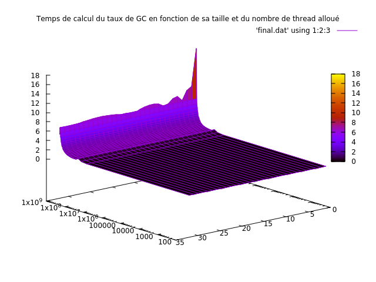
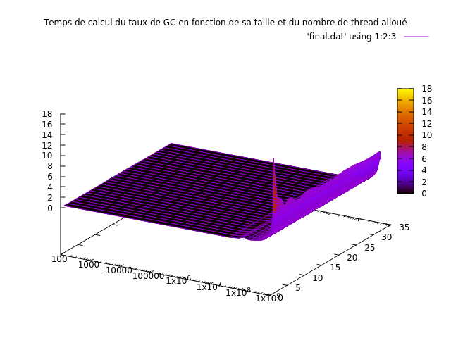
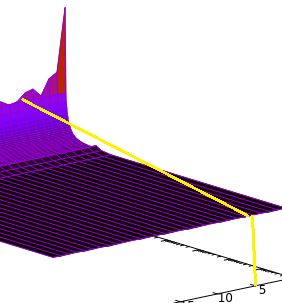
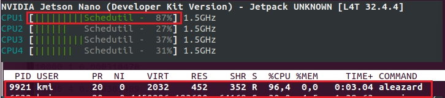
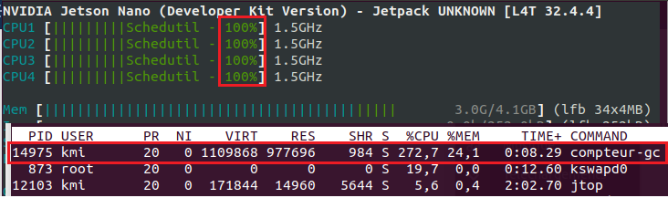
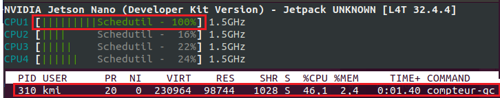

# Readme with review are not considered as true, they are only renderings of TP before correction.

##### Pour mémoire 
https://girishjoshi.io/post/glibc-pthread-cpu-affinity-linux/
à voir pour spécifier les CPU à utiliser...

## Fichiers présent

 - Makefile
 - compteur-gc.c
 - aleazard.c
 - test.sh
 - yoda.sh (pour tester rdv4)
 - fichiers d'images et graphiques
 - README.md

## Indications 

Pour commencer placez vous dans votre répertoire principale et clonez le repo : 
```bash
cd ~
git clone https://gitlab-etu.fil.univ-lille1.fr/billouard/pds-threads.git
cd pds-threads
```

Pour compiler compteur-gc.c : 
```bash
make compteur-gc
```
Pour compiler aleazard.c : 
```bash
make aleazard
```
L'exécutable compteur-gc sera lancé de la façon suivante :

```bash
./compteur-gc <nom_de_fichier> <nombre_de_threads>
```
Puis pour lancer la phase de test : 
```bash
make test
```
#### Travail à faire

L’objectif est de mettre en place la version _multithread  du calcul du taux G/C à partir d'une chaine de caractères générée aléatoirement par _aleazard.c_ .

Pour calculer de manière la plus précise possible le temps de calcul nécessaire à _compteur-gc.c_ pour nous renvoyer le taux de GC présent dans le génome, des appels à _clock_gettime_ sont effectués juste avant la création des threads et juste après la récupération des résultats.


### Protocole

Pour mener la campagne d’expériences, le script test.sh va faire varier à la fois la taille, de 100 octets à 1 gigas octets, des génomes et le nombre de threads variant de 1 à 32. Pour que notre mesure de temps soit valable nous avons pour chaque expérience, la taille de génome/nombre de threads, réalisé la moyenne sur plusieurs séries de tests (non présent dans le script fournit uniquement pour une série de tests). 
Le script génère ensuite les données dans un fichier temporaire (final.dat) qui sera supprimé après exécution. 
Enfin cela affiche le graphique et le sauvegarde en tant que _plot.png_ .

Les tests ont été réalisés sur un Jetson Nano possédant 4 coeurs. 
Afin d'expliquer au mieux notre démarche, nous utiliserons le graphique suivant : 





Ce graphique est représenté par 3 variables : le temps d'exécution (ordonnée / x) et sur les abscisses la taille du génome (axe y) et le nombre de thread ( axe z).
Ce graphique nous montre, de manière assez flagrante, que pour tout génome dont la taille n'est pas supérieure à 10^7 octets, le nombre de threads utilisés pour le calcul n'améliore pas les performances de manière significative. 

Si nous agrandissons ce graphique pour identifier le point de "rupture".
D'une part la taille du génome environ égale à 10^7 octets :

.

Et d'autre part, avec 4 threads nous observons une "cassure" se traduisant par une diminution du temps de calcul.

 .

Nous pouvons en tirer la conclusion que pour un fichier, dont la taille est inférieure à 10^7 octets, celui-ci n'a pas besoin d'être exécuté avec un programme multithreadé. 
En revanche, dans le cas d'un fichier d'une taille supérieur, le nombre de threads proposant la meilleure alternative est de quatre sur une machine de 4 coeurs. Nous avons aussi fait des tests sur une machine possédants 8 coeurs et là, le nombre de thread montrant de meilleurs résultats était de 8. 
De plus, le gain en temps de calcul n'est significatif que de 1 à 4 ou 8 threads, après il n'y a plus de différence importante.
À l'inverse, pour un fichier trop "petit", la création de thread consomme lui-même des ressources CPU et augmente donc le temps d'exécution.


Nous avons aussi fait le choix d'analyser l'utilisation des coeurs durant la phase de test.  
Voici l'utilisation des coeurs lors de l'exécution du générateur de génome aléatoire :

 

 Ici on peut voir qu'un seul coeur est utilisé avec ce programme non multithreadé.

 Puis lors du calcul du génome avec le programme multithreadé :



Ici, nous pouvons clairement voir la pleine utilisation des quatre coeurs par le programme du calcul du taux de GC.

Cependant, pour être le plus objectif possible, nous avons aussi observé par moment que les threads n'étaient seulement présents que sur un seul coeur : 




### Sémaphores

Pour tester rdv4 :

```bash
make sem_test
```
Ce test execute 100 fois rdv4 et en cas d'erreur le programme exit.

Le problème du rendez-vous est un problème dans les programmes à multi-threadé. Notre programme est divisé en N (ici 10) threads. Chacun de ces threads fonctionne avec deux fonctions a et b. Dans la première partie avec l'appel à la fonction a(), tous les threads sont indépendants et peuvent fonctionner simultanément. Cependant, un threads ne peut commencer la fonction b, que si les 10 threads ont terminé la fonction a. 

La variable _force_ est utilisée pour compter le nombre de threads qui ont atteint le point de rendez-vous. Le sémaphore "2" protège l'accès à la variable de comptage (_force_), qui est partagée entre les différents threads. Le sémaphore "1" est initialisé à 0. Le rendez-vous sera effectué en bloquant les threads sur le sémaphore "1" jusqu'à ce que les 10 threads aient atteint le point de rendez-vous.

Avec le sémaphore à 0, le premier thread qui execute la fonction a sera bloqué sur sem_wait(&sem1).
Les premiers 9 threads qui auront terminé leur première partie seront tous bloqués à cet endroit. Lorsque le 10 èmes threads terminera sa première phase, il incrémentera _force_ et exécutera ensuite sem_post(&sem1), ce qui libérera un premier thread. 
Le dernier thread sera alors bloqué sur sem_wait(&sem1), il ne restera pas bloqué car chaque fois qu'un thread parviendra à passer sem_wait(&sem1), il exécutera immédiatement sem_post(&sem1), ce qui libérera un autre thread.
